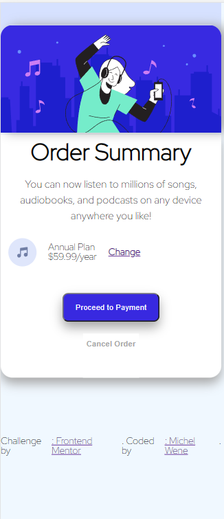

# Frontend Mentor - Order summary card solution

This is a solution to the [Order summary card challenge on Frontend Mentor](https://www.frontendmentor.io/challenges/order-summary-component-QlPmajDUj). Frontend Mentor challenges help you improve your coding skills by building realistic projects. 

## Table of contents

- [Overview](#overview)
  - [The challenge](#the-challenge)
  - [Screenshot](#screenshot)
  - [Links](#links)
- [My process](#my-process)
  - [Built with](#built-with)
  - [What I learned](#what-i-learned)
  - [Continued development](#continued-development)
  - [Useful resources](#useful-resources)
- [Author](#author)
- [Acknowledgments](#acknowledgments)


## Overview

### The challenge

Users should be able to:

- See hover states for interactive elements
- Shadow effect on main elements
- two background effects integrating
### Screenshot

- Desktop

- Mobile


### Links

- Solution URL: [https://github.com/michelwene/Order-Summary](https://github.com/michelwene/Order-Summary)
- Live Site URL: [https://michelwene.github.io/Order-Summary/](https://michelwene.github.io/Order-Summary/)

## My process

### Built with

- Semantic HTML5 markup
- CSS custom properties
- Flexbox
- Mobile-first workflow

### What I learned

```html
<h1>Some HTML code I'm proud of</h1>
<header class="cabecalhoPrincipal">
      <div class="container">
        <a>
          </a>
      </div>
    </header>
     <button class="botaoProcederPagamento">Proceed to Payment</button>
```
```css
.proud-of-this-css {
  color: papayawhip;
}

body{
    background-color: aliceblue; /*here I learned that depending on the order in which the values ​​are arranged, they react differently in the html.*/
    background-image: url("../../images/pattern-background-desktop.svg"); /*I wanted this color to be behind the background image, and just putting the color first, it already fits behind the background image.*/
    background-size: 100%;
    background-repeat: no-repeat;
    font-family: 'Red Hat Display';
}

/*
in this part I wanted to leave the box size equal to the header image, after several attempts I understood that I should change the "margin" value and it was the way I would like.*/
    .conteudoPrincipal{
    font-family: 'Red Hat Display';
    display: flex;
    justify-content: center;
    flex-direction: column;
    align-items: center;
    width: 450px;
    margin: auto;/*in this part*/
    background-color: white;
    border-radius: 0px 0px 20px 20px;
    box-shadow: 0 10px 18px #a8a8a8;
}

```

### Continued development


I plan to continue doing FrontendMentor projects, to improve my HTML and CSS, and then I will add to JavaScript, completing the "WEB Iron Trio"

### Useful resources

- [CSS tricks](https://css-tricks.com/snippets/css/a-guide-to-flexbox/) - This site helped me a lot in the element positioning part, as I only used flexbox to position the elements.
- [W3schools](https://www.w3schools.com/css/default.asp) - This site helps me a lot in my CSS questions, regarding the implementation of the styling models. 
- [GitHub](https://gist.github.com/leocomelli/2545add34e4fec21ec16) - This repository on Git provides me because in the beginning I was a little lost in the commands, and GitHub helped me a lot to find the right commands.


## Author

- Frontend Mentor - [@michelwene](https://www.frontendmentor.io/profile/michelwene)
- Linkedin - [@michelwene](https://www.linkedin.com/in/michelwene/)


## Acknowledgments

I want to thank the following people who answered some questions and helped me finish this project.
- [@JCDMeira](https://github.com/JCDMeira)
- [@arthurs159](https://github.com/arthurs159)

